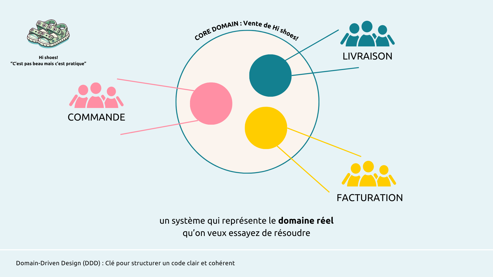
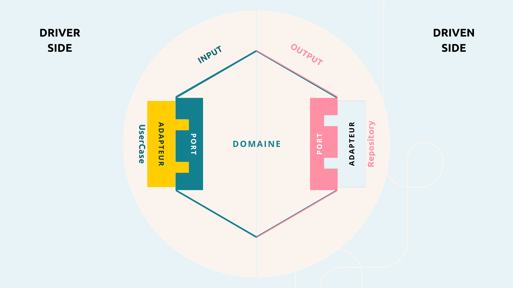

# Quand le code devient poésie...

⏰ Temps de lecture théorique estimé : 30 min

⏰ Temps d'exercice pratique estimé : 2h30

<!-- TOC -->
* [Quand le code devient poésie...](#quand-le-code-devient-poésie)
  * [Contexte de ce répo](#contexte-de-ce-répo)
    * [Ressources utiles](#ressources-utiles)
    * [Des questions ? Des retours ?](#des-questions--des-retours-)
    * [Pourquoi ce projet ?](#pourquoi-ce-projet-)
    * [Qu’allez-vous trouver ici ?](#quallez-vous-trouver-ici-)
    * [Vos premiers pas 🛠️](#vos-premiers-pas-)
    * [Versions](#versions)
  * [Installation et Exécution](#installation-et-exécution)
    * [Prérequis](#prérequis)
    * [Installation](#installation)
    * [Exécution](#exécution)
    * [Jeux de données et 🧪 Tests API avec Postman](#jeux-de-données-et--tests-api-avec-postman)
  * [Cas d'étude : Hi Shoes - "C'est pas beau, mais c'est pratique"](#cas-détude--hi-shoes---cest-pas-beau-mais-cest-pratique)
    * [Domaine Principal (Core Domain) : La gestion des commandes](#domaine-principal-core-domain--la-gestion-des-commandes)
    * [Sous-domaines dans l'exemple](#sous-domaines-dans-lexemple)
    * [Répartition par rôle vs par fonctionnalité](#répartition-par-rôle-vs-par-fonctionnalité)
    * [Concepts de DDD et Architecture Hexagonale](#concepts-de-ddd-et-architecture-hexagonale)
    * [Concepts abordés :](#concepts-abordés-)
* [🪶 Organisation du Code : Explorer les Concepts Clés du DDD et de l'Architecture Hexagonale](#-organisation-du-code--explorer-les-concepts-clés-du-ddd-et-de-larchitecture-hexagonale)
    * [1. `order/domain` : Le Cœur du Domaine Métier](#1-orderdomain--le-cœur-du-domaine-métier)
    * [2. `order/application` : Les Cas d’Utilisation](#2-orderapplication--les-cas-dutilisation)
    * [3. `order/infrastructure` : Les Adaptateurs Techniques](#3-orderinfrastructure--les-adaptateurs-techniques)
    * [4. Packages Vides : Préparation pour Facturation et Livraison](#4-packages-vides--préparation-pour-facturation-et-livraison)
    * [Principes Clés en Action](#principes-clés-en-action)
  * [Passer à la pratique : implémenter le domaine **`Facturation`** avec le DDD et l’Architecture Hexagonale](#passer-à-la-pratique--implémenter-le-domaine-facturation-avec-le-ddd-et-larchitecture-hexagonale)
    * [Objectifs pédagogiques](#objectifs-pédagogiques)
    * [Contexte du projet](#contexte-du-projet)
    * [À quoi t'attendre](#à-quoi-tattendre)
* [🪶 Passer à la pratique - exercice concret](#-passer-à-la-pratique---exercice-concret)
  * [**Etape 1 : Comprendre l’importance de la collaboration et de la langue d’ubiquité Strategic Design**](#etape-1--comprendre-limportance-de-la-collaboration-et-de-la-langue-dubiquité-strategic-design)
    * [Contexte](#contexte)
    * [Pourquoi Strategic Design ?](#pourquoi-strategic-design-)
    * [Définir le domaine et ses sous-domaines](#définir-le-domaine-et-ses-sous-domaines)
    * [Objectif pédagogique](#objectif-pédagogique)
    * [Actions pratiques](#actions-pratiques)
    * [Concepts DDD impliqués](#concepts-ddd-impliqués)
  * [Étape 2 : Identifier les cas d’utilisation métier](#étape-2--identifier-les-cas-dutilisation-métier)
    * [Contexte](#contexte-1)
    * [Pourquoi identifier les cas d’utilisation dans une approche DDD ?](#pourquoi-identifier-les-cas-dutilisation-dans-une-approche-ddd)
    * [Exemple dans HiShoes — Sous-domaine Facturation](#exemple-dans-hishoes--sous-domaine-facturation)
    * [Objectif pédagogique de l’étape](#objectif-pédagogique-de-létape)
    * [Concepts DDD impliqués](#concepts-ddd-impliqués-1)
    * [**Actions pratiques**](#actions-pratiques-1)
    * [🎯 **Méthodologie pour identifier les cas d’utilisation**](#-méthodologie-pour-identifier-les-cas-dutilisation)
    * [**Pièges à éviter**](#pièges-à-éviter)
  * [**Étape 3 : Conceptualiser le modèle du domaine**](#étape-3--conceptualiser-le-modèle-du-domaine)
    * [**Contexte**](#contexte-2)
    * [**Pourquoi modéliser le domaine en DDD ?**](#pourquoi-modéliser-le-domaine-en-ddd)
    * [**Objectif pédagogique de l’étape**](#objectif-pédagogique-de-létape-1)
    * [**Méthodologie pour conceptualiser le modèle**](#méthodologie-pour-conceptualiser-le-modèle)
    * [1️⃣ **Identifier les concepts métier stables et distincts**](#1-identifier-les-concepts-métier-stables-et-distincts)
    * [2️⃣ **Classer ces concepts**](#2-classer-ces-concepts)
    * [3️⃣ **Définir les relations**](#3-définir-les-relations)
    * [**Résultat attendu**](#résultat-attendu)
    * [**Pièges à éviter pour un débutant**](#pièges-à-éviter-pour-un-débutant)
  * [Étape 4 : Implémentation du modèle](#étape-4--implémentation-du-modèle)
    * [**Contexte**](#contexte-3)
    * [**Pourquoi implémenter le modèle avant tout autre chose ?**](#pourquoi-implémenter-le-modèle-avant-tout-autre-chose-)
    * [**Objectif pédagogique**](#objectif-pédagogique-1)
    * [**Exercice pratique et méthodologie**](#exercice-pratique-et-méthodologie)
    * [**Pièges à éviter**](#pièges-à-éviter-1)
  * [Étape 5 : Création des services du domaine](#étape-5--création-des-services-du-domaine)
    * [**Contexte**](#contexte-4)
    * [**Pourquoi créer des services de domaine en DDD ?**](#pourquoi-créer-des-services-de-domaine-en-ddd-)
    * [**Objectif pédagogique**](#objectif-pédagogique-2)
    * [**Quand créer un service de domaine ?**](#quand-créer-un-service-de-domaine-)
    * [**Passer à la pratique : Facturation de HiShoes**](#passer-à-la-pratique--facturation-de-hishoes)
    * [**Résultat attendu**](#résultat-attendu-1)
    * [**Pièges à éviter pour un débutant**](#pièges-à-éviter-pour-un-débutant-1)
  * [Étape 6 : Implémentation des cas d’utilisation — Pattern Command / Query](#étape-6--implémentation-des-cas-dutilisation--pattern-command--query)
    * [**Pourquoi utiliser un pattern Command / Query ?**](#pourquoi-utiliser-un-pattern-command--query-)
    * [**Objectif pédagogique**](#objectif-pédagogique-3)
    * [🌟 **Explication du pattern Command / Query dans le contexte DDD**](#-explication-du-pattern-command--query-dans-le-contexte-ddd)
    * [**Command : exprimer une intention**](#command--exprimer-une-intention)
    * [**Query : fournir des informations pour guider une décision**](#query--fournir-des-informations-pour-guider-une-décision)
    * [**Vision complémentaire : le dialogue Command / Query**](#vision-complémentaire--le-dialogue-command--query)
    * [**Pourquoi ce pattern est utile ?**](#pourquoi-ce-pattern-est-utile-)
    * [**Exercice pratique**](#exercice-pratique)
    * [**Résultat attendu**](#résultat-attendu-2)
    * [**Pièges à éviter**](#pièges-à-éviter-2)
  * [**Étape 7 : Ports et adaptateurs sortants**](#étape-7--ports-et-adaptateurs-sortants)
    * [**Contexte**](#contexte-5)
    * [**Pourquoi des ports et adaptateurs ?**](#pourquoi-des-ports-et-adaptateurs-)
    * [**Objectif pédagogique**](#objectif-pédagogique-4)
    * [Passer à la pratique](#passer-à-la-pratique)
    * [**Résultat attendu**](#résultat-attendu-3)
    * [**Pièges à éviter pour un débutant**](#pièges-à-éviter-pour-un-débutant-2)
  * [**Étape finale : Assemblage et test de bout en bout**](#étape-finale--assemblage-et-test-de-bout-en-bout)
    * [**Contexte**](#contexte-6)
    * [**Objectif pédagogique**](#objectif-pédagogique-5)
* [🪶 **Résultat attendu ou proposition de compréhension du domaine métier de l’entreprise**](#-résultat-attendu-ou-proposition-de-compréhension-du-domaine-métier-de-lentreprise)
  * [Étape 1 : Comprendre l’importance de la collaboration et de la langue d’ubiquité (Strategic Design)](#étape-1--comprendre-limportance-de-la-collaboration-et-de-la-langue-dubiquité-strategic-design)
  * [Étape 2 : Identifier les cas d’utilisation métier](#étape-2--identifier-les-cas-dutilisation-métier-1)
    * [**Cas d’utilisation identifiés pour HiShoes — Facturation**](#cas-dutilisation-identifiés-pour-hishoes--facturation)
    * [**Résultat attendu**](#résultat-attendu-4)
    * [**Exemple de cas d’utilisation : Créer une facture pour une commande validée**](#exemple-de-cas-dutilisation--créer-une-facture-pour-une-commande-validée)
    * [**Nom du cas d’utilisation**](#nom-du-cas-dutilisation)
    * [**Objectif**](#objectif)
    * [**Acteurs principaux**](#acteurs-principaux)
    * [**Pré-condition**](#pré-condition)
    * [**Déclencheur**](#déclencheur)
    * [**Description du scénario principal**](#description-du-scénario-principal)
    * [**Règles métier**](#règles-métier)
    * [**Exceptions**](#exceptions)
    * [**Post-condition**](#post-condition)
    * [**Données manipulées**](#données-manipulées)
    * [**Langue d’ubiquité utilisée**](#langue-dubiquité-utilisée)
    * [**Étape 3 : Conceptualiser le modèle du domaine**](#étape-3--conceptualiser-le-modèle-du-domaine-1)
    * [Agrégat racine : **Facture (Invoice)**](#agrégat-racine--facture-invoice)
    * [Entités et objets de valeur](#entités-et-objets-de-valeur)
    * [**Règles métier intégrées au modèle**](#règles-métier-intégrées-au-modèle)
  * [Étape 4 : Implémentation du modèle](#étape-4--implémentation-du-modèle-1)
    * [1️⃣ **Commence par les objets de valeur**](#1-commence-par-les-objets-de-valeur)
    * [2️⃣ **Code l’agrégat racine**](#2-code-lagrégat-racine)
    * [3️⃣ **Implémente les autres entités / VO**](#3-implémente-les-autres-entités--vo)
  * [Notion importante : l’objet est garant de son intégrité](#notion-importante--lobjet-est-garant-de-son-intégrité)
    * [**Mauvaise approche (la règle est laissée au code extérieur)**](#mauvaise-approche-la-règle-est-laissée-au-code-extérieur)
    * [**Bonne approche (le modèle garantit lui-même son intégrité)**](#bonne-approche-le-modèle-garantit-lui-même-son-intégrité)
  * [Étape 5 : Création des services du domaine](#étape-5--création-des-services-du-domaine-1)
    * [**Exemple de code (Java / pseudo code simplifié)**](#exemple-de-code-java--pseudo-code-simplifié)
  * [Étape 6 : Implémentation des cas d’utilisation — Pattern Command / Query](#étape-6--implémentation-des-cas-dutilisation--pattern-command--query-1)
    * [**Structure type d’un cas d’utilisation**](#structure-type-dun-cas-dutilisation)
    * [**Exemple concret : créer une facture (Command)**](#exemple-concret--créer-une-facture-command)
    * [📝 **Command**](#-command)
    * [📝 **CommandHandler**](#-commandhandler)
    * [**Exemple concret : retrouver une facture (Query)**](#exemple-concret--retrouver-une-facture-query)
    * [📝 **Query**](#-query)
    * [📝 **QueryHandler**](#-queryhandler)
  * [Étape 7 : Ports et adaptateurs sortants](#étape-7--ports-et-adaptateurs-sortants-1)
    * [**Exemple concret : Facturation HiShoes**](#exemple-concret--facturation-hishoes)
    * [**Port : `InvoiceRepository`**](#port--invoicerepository)
    * [**Port : `PaymentProcessor` (exemple optionnel)**](#port--paymentprocessor-exemple-optionnel)
    * [**Adaptateur sortant : une implémentation de `InvoiceRepository`**](#adaptateur-sortant--une-implémentation-de-invoicerepository)
  * [Étape finale : Assemblage et test de bout en bout](#étape-finale--assemblage-et-test-de-bout-en-bout-1)
    * [1️⃣ **Adaptateurs entrants : exposer les cas d’utilisation**](#1-adaptateurs-entrants--exposer-les-cas-dutilisation)
    * [2️⃣ **Assembler les ports et adaptateurs**](#2-assembler-les-ports-et-adaptateurs)
    * [3️⃣ **Écrire un test de bout en bout**](#3-écrire-un-test-de-bout-en-bout)
* [🪶 Evolutions](#-evolutions)
* [🪶 **Des questions ? Des retours ?**](#-des-questions--des-retours-)
<!-- TOC -->

## Contexte de ce répo

Dans le monde de la technologie, maîtriser quelques concepts clés peut faire toute la différence entre un bon·ne développeur·euse et un·e développeur·euse exceptionnel·le. Les design patterns sont ces concepts essentiels qui vous permettront de produire des applications de haute qualité, faciles à maintenir et à faire évoluer. Vous n’avez pas besoin de connaître tous les design patterns. Un ou deux peuvent suffire, et aujourd’hui je vous propose de découvrir l’architecture hexagonale et le Domain Driven Design.

Que vous soyez un·e novice intrépide ou un·e vétéran·e chevronné·e de la tech, l’architecture hexagonale permet d'éviter les pièges et les écueils lorsque plusieurs développeurs collaborent sur un même projet.

Alors je vous propose une courte session pour transformer vos lignes de code en véritable poésie…

Ce répo git vient en support pratique de la conférence ["Quand le code devient poésie..."](https://hiweb.fr/conference-quand-le-code-devient-poesie) de [Chloé Guilbaud](https://hiweb.fr/conference/linkedin), co-fondatrice du collectif de freelance [Hi Web!](https://hiweb.fr).
Pour consulter la description complète de la conférence : [Quand le code devient poésie...](https://hiwebfr.notion.site/CFP-Quand-le-code-devient-po-sie-2d275dfff6744a0482c2b2310a0dde83?source=copy_link).

### Ressources utiles
Parce que la connaissance seule ne suffit pas : c’est en pratiquant qu’on progresse vraiment. Après la conférence, je vous invite à plonger dans le code ! Et pour cela, je vous offre un petit cadeau : un répertoire Git et des ressources pour continuer à explorer et expérimenter par vous-même.
- Ce répertoire Git : un ensemble d’exemples pratiques et de projets que chacun·e peut explorer et adapter. Rien de tel que de mettre les mains dans le code pour bien assimiler les concepts.
- [La cheat sheet](https://hiweb.fr/conference/quand-le-code-devient-poesie/form) : un guide rapide qui regroupe l’essentiel des concepts et des bonnes pratiques, pour vous aider à les appliquer plus facilement.
- [La description de la conférence Quand le code devient poésie...](https://hiwebfr.notion.site/CFP-Quand-le-code-devient-po-sie-2d275dfff6744a0482c2b2310a0dde83?source=copy_link) : pour retrouver le fil conducteur de la session et prolonger la réflexion. 
- [Article de blog](https://hiweb.fr/conference-quand-le-code-devient-poesie) : Retrouvez un récapitulatif complet, les actualités sur le sujet, et tous les supports de la conférence.
- 👉 N’hésitez pas à forker le projet, à tester, à modifier et à partager vos idées : c’est en expérimentant qu’on apprend le mieux !

### Des questions ? Des retours ?

Je serais ravie d’échanger avec vous sur vos expériences, vos questions, ou vos suggestions pour améliorer ce projet.

📧 **Contactez-moi** : Chloé Guilbaud

🔗 **Retrouvez-moi sur LinkedIn** : [Chloé Guilbaud](https://www.linkedin.com/in/chloeguilbaud/)

### Pourquoi ce projet ?

Lors de la conférence “Quand le code devient poésie…”, nous avons exploré ensemble les concepts clés du **DDD** et comment cette approche, associée à une architecture hexagonale, peut transformer votre manière de concevoir des logiciels. Mais apprendre ces concepts en théorie, c’est une chose. Les **mettre en pratique**, c’en est une autre !

Ce projet est conçu pour :

- **Démystifier le DDD** grâce à un exemple concret : une boutique de vente en ligne de chaussures, les HiShoes 🥿. Le slogan de la boutique : « c’est pas beau, mais c’est pratique »
- **Explorer l’architecture hexagonale** en manipulant du code organisé autour des ports et des adaptateurs.
- Vous permettre de **mettre les mains dans le code** et d’appliquer ces concepts dans des situations réelles.

### Qu’allez-vous trouver ici ?

- Un **exemple d’application** qui illustre des concepts tels que :
    - **Entités, Value Objects et Domain Events**
    - **Bounded Contexts et Use Cases**
    - **Ports et Adaptateurs** dans une architecture hexagonale
- Des exercices pour expérimenter, adapter et améliorer le projet.
- Une organisation de code qui suit les bonnes pratiques pour faciliter votre apprentissage.

### Vos premiers pas 🛠️

Plongez dans le projet, suivez les instructions, et explorez les différents modules. Tout est conçu pour vous guider et vous permettre d’expérimenter par vous-même. N’hésitez pas à casser, corriger, et réinventer le code.

#szsz# Couche technique

Ce projet est développé en **Java** avec les frameworks et outils suivants :

- **Maven** : pour la gestion des dépendances et le cycle de vie du projet.
- **Spring Boot** : pour simplifier le développement d'applications basées sur Spring, notamment grâce à ses fonctionnalités comme l'injection de dépendances, la gestion des configurations, et les démarrages rapides.

### Versions

- Java : `23`
- Maven : `4.0.O`
- Spring Boot : `3.3.4`

## Installation et Exécution

### Prérequis

Assures toi d'avoir les éléments suivants installés sur votre machine :

- **Java** (JDK 11 ou supérieur, selon la configuration de votre projet)
- **Maven** (version 3.x ou supérieure)
- (Optionnel) Un IDE compatible avec Maven (comme IntelliJ IDEA, Eclipse ou VS Code)

### Installation

1. **Cloner le dépôt :**

    ```bash
    git clone <URL_DU_DEPOT>
    cd <NOM_DU_PROJET>
    
    ```

2. **Installer les dépendances et compiler le projet :**
   Utilisez la commande Maven suivante pour nettoyer, compiler et installer les dépendances :

    ```bash
    mvn clean install
    
    ```


### Exécution

1. **Lancer l'application :**
   Avec Maven, vous pouvez exécuter l'application directement en utilisant le plugin Spring Boot :

    ```bash
    mvn spring-boot:run
    
    ```

   Ou si l'application a été empaquetée (par exemple en `.jar`) :

    ```bash
    java -jar target/<NOM_DU_JAR>.jar
    
    ```

### Jeux de données et 🧪 Tests API avec Postman

Un dossier `postman/` contient des **jeux de requêtes Postman** permettant de tester rapidement l’API REST exposée par cette application.

**Emplacement :**

```
src/test/resources/postman/
```

**Contenu :**

`codepoeme.postman-collection.json`
- hello world `POST /hello`
- exemples de requêtes `POST /invoice`, `GET /invoices`
- commandes d'achat de hiShoes `POST /order`

**Comment les utiliser :**

1. Ouvre Postman
2. Clique sur **Importer** (`File > Import` ou icône "+" → **Import**)
3. Sélectionne le fichier `.json` dans `src/test/resources/postman/`
4. Laisse Postman importer la collection
5. Exécute les requêtes (vérifie que le backend est bien démarré sur `localhost:8080`)


## Cas d'étude : Hi Shoes - "C'est pas beau, mais c'est pratique"

Dans cette conférence, nous explorons un cas d'étude concret autour de la boutique en ligne **Hi Shoes**, une entreprise qui vend des chaussures pratiques et fonctionnelles, avec un slogan qui résume parfaitement leur concept :

**"C'est pas beau, mais c'est pratique"**.

### Domaine Principal (Core Domain) : La gestion des commandes

Le cœur de l'application se concentre sur la gestion des commandes de chaussures **Hi Shoes**. Le **core domain** repose sur des concepts clés permettant de suivre les actions essentielles liées aux commandes, aux clients et aux produits (les HiShoes). Nous appliquons les principes de **Domain-Driven Design (DDD)** et l'**architecture hexagonale** pour modéliser et isoler la logique métier des autres préoccupations techniques.

### Sous-domaines dans l'exemple

Dans cet exemple, nous avons simplifié les choses en définissant trois sous-domaines distincts, correspondant à des rôles dans le processus de vente des HiShoes :

1. **Order (Gestion des commandes)** :
    - Ce sous-domaine traite de la création et de l'enregistrement des commandes de chaussures.
    - Il inclut des entités comme **Order** (commande), avec des **events** comme `OrderHasBeenCreated`, et des services métier comme `CreateOrderService` pour la gestion des commandes.
2. **Facturation (Billing)** :
    - Ce sous-domaine est responsable de la génération et de l'enregistrement des factures liées aux commandes passées par les clients.
    - Bien que ce sous-domaine ne soit pas encore implémenté dans cet exemple, il pourrait inclure des services comme **`InvoiceService`** et des entités comme **`Invoice`**.
3. **Livraison (Shipping)** :
    - Ce sous-domaine gère l'acheminement des commandes une fois qu'elles sont enregistrées et facturées.
    - Il pourrait inclure des services comme **`ShippingService`** et des entités comme **`Shipment`**, représentant les informations de livraison liées à chaque commande.

### Répartition par rôle vs par fonctionnalité

Dans cet exemple, nous avons fait le choix de structurer le code en **sous-domaines par rôle**, c'est-à-dire en créant des packages séparés pour chaque fonction ou département comme `order`, `facturation` et `livraison`. Ce découpage est simple à comprendre et peut convenir pour des systèmes petits ou avec des équipes qui ont des responsabilités claires et bien séparées.

Cependant, dans un véritable projet à grande échelle, il est généralement préférable d'opter pour un **découpage par fonctionnalité**, afin de mieux refléter les **fonctionnalités métiers** transverses et d'encourager une meilleure collaboration entre les équipes. Cela permet aussi d'éviter des dépendances trop fortes entre les sous-domaines. Voici un exemple de découpage par fonctionnalité :

- **Gestion des commandes** : Ce module regroupe à la fois la création de la commande, la facturation et la gestion de la livraison en un seul ensemble fonctionnel. Par exemple, une fonctionnalité **"Passer une commande"** pourrait inclure le processus complet de commande, paiement et expédition.
- **Gestion des clients** : Ce module pourrait inclure l'enregistrement des clients, la mise à jour des informations de contact et l'historique des commandes, mais aussi la gestion des réductions ou des programmes de fidélité.

Ce type de découpage par fonctionnalité permettrait une plus grande autonomie des équipes et une flexibilité accrue pour gérer les évolutions du système.

### Concepts de DDD et Architecture Hexagonale

Nous appliquons une **architecture hexagonale** pour isoler le domaine métier des dépendances techniques. Voici un rappel des concepts utilisés :

- **Core Domain** : La logique métier essentielle, représentée par des **entités**, des **values objects** et des **services** métier.
- **Bounded Context** : Chaque sous-domaine est modélisé et isolé à l'intérieur d'un contexte bien défini, évitant ainsi les interférences avec d'autres sous-domaines.
- **Ports et Adapters** : Nous exposons des **ports** (interfaces) pour la communication avec l'extérieur (API REST dans notre cas avec `OrderController`) et les **adapters** qui fournissent les implémentations concrètes (comme les repositories en mémoire).

L'application est construite de manière à séparer les préoccupations liées à la logique métier et les aspects techniques, permettant ainsi une meilleure compréhension du domaine et une flexibilité accrue pour évoluer et ajouter de nouvelles fonctionnalités.

### Concepts abordés :

- **DDD – Domain-Driven Design** : Comprendre le domaine métier, les modèles riches, les Use Cases, et la langue d’ubiquité.



- **Architecture hexagonale** : Isolation de la logique métier, ports et adaptateurs, séparation des préoccupations entre domaine et infrastructure.



Ces ressources sont conçues pour prolonger votre apprentissage et vous encourager à expérimenter avec le code. Si vous avez des questions ou souhaitez échanger des idées, je suis toujours ravie de discuter — connectez-moi sur [LinkedIn](https://www.linkedin.com/in/chloeguilbaud/) !

# 🪶 Organisation du Code : Explorer les Concepts Clés du DDD et de l'Architecture Hexagonale

Ce projet est structuré selon les principes du **DDD** et de l’**architecture hexagonale**. Cette organisation a pour but de séparer les préoccupations (logique métier, infrastructure technique, etc.) pour rendre le code plus compréhensible, maintenable et extensible.

Voici une description des principaux packages :

```markdown
📦 hiweb.codepoem
└── 📦 order
    ├── 📂 domain                    # Cœur métier (Domain)
    │   ├── 📂 model                 # Modèles du domaine
    │   │   ├── 📄 Client.java           # Entité Client
    │   │   ├── 📄 HiShoe.java           # Entité HiShoe
    │   │   ├── 📄 HiShoe_COLOR.java     # Value Object pour la couleur (ex : RGB)
    │   │   ├── 📄 HiShoe_MODEL.java     # Value Object pour le modèle
    │   │   └── 📄 Order.java            # Aggregate Root pour les commandes
    │   │
    │   ├── 📂 events                 # Événements de domaine
    │   │   └── 📄 OrderHasBeenCreated.java # Événement déclenché lorsqu'une commande est créée
    │   │
    │   ├── 📂 exception             # Exceptions du domaine
    │   │   ├── 📄 InvalidShoeSizeException.java  # Exception pour tailles invalides
    │   │   └── 📄 HiShoeNotFoundException.java   # Exception pour chaussures introuvables
    │   │
    │   ├── 📂 service               # Services métier
    │   │   ├── 📄 CreateOrderService.java       # Service métier pour la création de commande
    │   │   └── 📄 DiscountCalculatorService.java # Service métier pour les calculs de réduction
    │   │
    │   └── 📂 port                  # Ports pour les interfaces
    │       ├── 📂 usecase           # Cas d’utilisation
    │       │   ├── 📄 RegisterOrderCommand.java  # Commande pour enregistrer une commande
    │       │   └── 📄 RegisterOrderUseCase.java  # Interface définissant le cas d’utilisation
    │       │
    │       ├── 📂 repository        # Interfaces des repositories
    │       │   ├── 📄 ClientRepository.java      # Interface pour gérer les clients
    │       │   ├── 📄 HiShoeRepository.java      # Interface pour gérer les HiShoes
    │       │   └── 📄 OrderRepository.java       # Interface pour gérer les commandes
    │       │
    │       └── 📂 dispatcher        # Interface pour la gestion des événements
    │           └── 📄 EventDispatcher.java       # Interface pour dispatcher les événements
    │
    ├── 📂 application               # Couche Application
    │   └── 📂 controllers           # Contrôleurs exposant l'application
    │       └── 📄 OrderController.java # Contrôleur pour gérer les commandes (REST API)
    │
    ├── 📂 infrastructure            # Adaptateurs techniques (Infrastructure Layer)
    │   ├── 📂 repository            # Implémentations des repositories (stockage des données)
    │   │   ├── 📄 InMemoryClientRepository.java   # Repository pour les clients (en mémoire)
    │   │   ├── 📄 InMemoryHiShoeRepository.java   # Repository pour les chaussures (en mémoire)
    │   │   └── 📄 InMemoryOrderRepository.java    # Repository pour les commandes (en mémoire)
    │   │
    │   └── 📄 EventDispatcherImpl.java           # Implémentation concrète de l’interface EventDispatcher
    │
    ├── 📂 facturation               # Package réservé pour la facturation (vide pour l’instant)
    └── 📂 livraison                 # Package réservé pour la livraison (vide pour l’instant)

```

### 1. `order/domain` : Le Cœur du Domaine Métier

C’est ici que réside toute la **logique métier**. Cette couche est **indépendante des technologies** et représente les règles, concepts et invariants propres à la boutique HiShoes.

**Contenu** :

- **Modèles Métier** :
    - **Entités** comme `Client`, `HiShoe`, et `Order` qui capturent les caractéristiques principales de chaque concept.
    - **Value Objects** comme `HiShoe_COLOR` ou `HiShoe_MODEL`, pour représenter des valeurs immuables liées aux chaussures.
    - **Aggrégats** : L’entité `Order` agit comme **Aggregate Root**, garantissant la cohérence des opérations sur les commandes.
- **Services Métier** :
    - `CreateOrderService` : Contient les règles pour créer une commande.
    - `DiscountCalculatorService` : Gère les calculs liés aux réductions.
- **Événements de Domaine** :
    - `OrderHasBeenCreated` : Représente un événement significatif du domaine.
- **Exceptions Métier** :
    - `InvalidShoeSizeException` ou `HiShoeNotFoundException` pour capturer des erreurs spécifiques au domaine.
- **Ports pour les Use Cases** :
    - `RegisterOrderCommand` : Représente les données nécessaires pour créer une commande.
    - `RegisterOrderUseCase` : Définit l’interface pour exécuter ce cas d’utilisation.
- **Ports pour la couche technique** :
    - `ClientRepository` : Définit l’interface pour la persistance `Client`.
    - `HiShoeRepository` : Définit l’interface pour la persistance `HiShoe`.
    - `OrderRepository` : Définit l’interface pour la persistance `Order`.

**Lien avec les principes du DDD** :

- Cette couche se concentre sur le **domaine métier**.
- Les modèles sont riches en comportement, favorisant un code **orienté métier** et non centré sur les données.

### 2. `order/application` : Les Cas d’Utilisation

Ce package expose les **cas d’utilisation** qui traduisent les intentions métier en actions concrètes.

**Contenu** :

- **Contrôleurs** :
    - `OrderController` : Interface d’entrée exposée via une API HTTP.
    - Ce contrôleur traduit les requêtes utilisateur en commandes pour les **Use Cases**.

**Lien avec les principes de l’architecture hexagonale** :

- Cette couche représente le **Driver Side** (ou côté entrant).
- Elle orchestre les interactions entre l’utilisateur et la logique métier via des **ports**.
- Application du pattern Command/Query.

### 3. `order/infrastructure` : Les Adaptateurs Techniques

Cette couche gère les aspects techniques et l’intégration avec les systèmes externes.

**Contenu** :

- **Adaptateurs pour les Repositories** :
    - `InMemoryClientRepository`, `InMemoryHiShoeRepo`, `InMemoryOrderRepo` : Implémentations en mémoire pour stocker temporairement les données.
- **Event Dispatcher** (futur développement) :
    - Pour publier et propager les **Domain Events** dans d’autres parties du système.

**Lien avec les principes de l’architecture hexagonale** :

- Cette couche représente le **Driven Side** (ou côté sortant).
- Les adaptateurs techniques implémentent les interfaces définies dans le domaine (`ClientRepository`, `OrderRepository` et `HiShoeRepository`) pour garantir une indépendance vis-à-vis des technologies.

### 4. Packages Vides : Préparation pour Facturation et Livraison

- **`order/billing`** et **`order/shipping`** sont des **contextes potentiels** à développer.
- Chacun de ces contextes pourrait devenir un **Bounded Context** distinct avec ses propres modèles métier, ports, et adaptateurs.

**Lien avec les principes DDD** :

- La séparation en contextes permet de respecter les **Bounded Contexts** et d’éviter un modèle global trop complexe.

### Principes Clés en Action

1. **Séparation des préoccupations** :
    - Le domaine métier est **isolé** des détails techniques.
    - Les cas d’utilisation orchestrent les interactions.
    - L’infrastructure est interchangeable et encapsulée.
2. **Ports et Adaptateurs** :
    - Les **ports** définissent les interfaces pour les use cases et les services techniques (comme les repositories).
    - Les **adaptateurs** fournissent des implémentations concrètes de ces interfaces.
3. **Indépendance Technologique** :
    - Toute la logique métier peut être testée sans dépendre des frameworks ou de la base de données.
4. **Ubiquitous Language** :
    - Le code reflète directement les termes du domaine métier, ce qui favorise une compréhension partagée entre développeuses et expertes métier.

## Passer à la pratique : implémenter le domaine **`Facturation`** avec le DDD et l’Architecture Hexagonale

Bienvenue dans cet exercice consacré à la **gestion de la facturation** pour la boutique en ligne **Hi Shoes**. Cet exercice est conçu pour te permettre de découvrir et d'appliquer les principes fondamentaux du **Domain-Driven Design (DDD)** et de l'**architecture hexagonale** à travers un cas concret et pratique.

Hi Shoes est une entreprise qui vend des chaussures pratiques et fonctionnelles. Leur slogan est simple et percutant : **"C'est pas beau, mais c'est pratique"**. Dans cet exercice, tu travailleras sur un des aspects clés de leur système : la gestion des commandes et, plus spécifiquement, la gestion de la facturation.

### Objectifs pédagogiques

L'objectif de cet exercice est de te guider dans la création d'une partie du système de facturation en appliquant les concepts du DDD et de l'architecture hexagonale. À travers l'implémentation des cas d'utilisation **`CreateInvoiceUseCase`** et **`PayInvoiceUseCase`**, tu apprendras à :

- **Modéliser un domaine** en DDD en créant des entités, des objets de valeur et des agrégats.
- **Séparer les responsabilités** de l'application à travers une architecture hexagonale, en définissant des ports et des adaptateurs pour gérer l'interaction avec le monde extérieur.
- **Réaliser des cas d'utilisation** qui incarnent les règles métiers d'un domaine, en respectant les bonnes pratiques de conception.

L'exercice est conçu pour être accessible même si tu débutes en DDD et en architecture hexagonale. Tu apprendras en écrivant du code et en découvrant comment structurer une application de manière propre et évolutive.

### Contexte du projet

Dans l'exemple de l'application Hi Shoes, nous avons déjà les sous-domaines de **Gestion des commandes (Order)** et de **Livraison (Shipping)**. Nous allons maintenant ajouter le sous-domaine **Facturation (Billing)** qui gère la création des factures pour chaque commande passée par un client.

La gestion des factures chez Hi Shoes doit permettre de créer des factures à partir des commandes passées par les clients et de traiter les paiements associés. Le domaine de la facturation est en pleine évolution, et c'est là que tu interviens pour améliorer et implémenter deux cas d'utilisation majeurs : **la création de factures** et **le paiement des factures**.

### À quoi t'attendre

Au fur et à mesure de cet exercice, tu seras amené à implémenter des parties essentielles de la logique métier, tout en respectant une architecture claire et modulable. Tu exploreras un projet qui est à la fois flexible et robuste, et tu verras comment appliquer des pratiques de développement durable et cohérentes.

Prépare-toi à mettre les mains dans le code et à réfléchir à la structure du domaine. Cet exercice est une excellente occasion d’approfondir tes compétences en architecture logicielle et d’acquérir une compréhension solide des principes du DDD et de l'architecture hexagonale.

# 🪶 Passer à la pratique - exercice concret

Pour chaque étape, je t’invite vivement à té référer à la cheatsheet et pour rappel tu trouveras une proposition d’implementation dans le package : `billing.implementation.exemple`. 

## **Etape 1 : Comprendre l’importance de la collaboration et de la langue d’ubiquité Strategic Design**

### Contexte

Tu viens d’intégrer une équipe qui développe le système de gestion des commandes et des factures pour la boutique en ligne **HiShoes**, spécialisée dans la vente de chaussures.

👉 Une difficulté freine le projet : les développeurs et les experts métier utilisent des mots différents pour parler des mêmes concepts, ce qui crée des malentendus et des erreurs de modélisation.

Ta première mission : poser les bases d’une **langue d’ubiquité** — un vocabulaire commun partagé par toutes les parties prenantes (métier + tech).

Ce langage commun :

- facilite la communication au quotidien,
- guide la modélisation des concepts métier,
- aligne la technologie avec les besoins réels de l’entreprise.

### Pourquoi Strategic Design ?

Quand on construit une architecture en *Domain-Driven Design* (DDD), la première étape consiste à :

✅ **Réunir les experts métier et les experts techniques autour de la table**.

✅ **Se mettre d’accord sur le fonctionnement d’une partie précise de l’entreprise (le domaine)**.

C’est ce qu’on appelle le **Strategic Design** :

👉 Le but n’est pas de faire un consensus sur tout, mais que les membres concernés par un même sous-domaine parlent la même langue.

### Définir le domaine et ses sous-domaines

- **Domaine** : sujet ou activité sur laquelle l’application est construite.
- **Sous-domaine** : partie fonctionnelle spécifique du domaine.

💡 *Dans notre cas :*

- **Domaine principal (Core Domain)** : *Vente de chaussures en ligne (HiShoes)*
- **Sous-domaines identifiés** :
    - Gestion des commandes (Order)
    - Livraison (Shipping)
    - 💡 *Nouveau :* Facturation (Billing)

⚠ **Remarque :**

👉 La détermination des sous-domaines ne doit pas se faire uniquement côté technique. Elle doit être réalisée **en groupe**, avec les experts métier.

👉 C’est un **processus itératif** : on ajuste au fur et à mesure que la compréhension du domaine évolue.

### Objectif pédagogique

✅ Comprendre et définir les concepts métier essentiels pour établir une langue commune qui :

- reflète fidèlement la réalité du domaine,
- servira de socle à la modélisation et au code.

### Actions pratiques

💬 *Mets-toi dans la peau d’un développeur assistant à une réunion avec l’équipe Facturation.*

➡ L’équipe métier évoque des termes comme :

- `Commande`
- `Facture`
- `Montant`
- `Paiement`

📝 **Ta mission :**

1️⃣ Interroge-les pour **comprendre ce que chaque terme signifie dans leur contexte**.

2️⃣ Rédige des **définitions claires et simples** (sans jargon technique), comme si tu devais les expliquer à une nouvelle recrue.

3️⃣ Conserve ces définitions comme référence. Elles guideront toute la suite (modèle, code, documentation).

### Concepts DDD impliqués

- **Langue d’ubiquité (Ubiquitous Language)** :

  Un vocabulaire partagé entre développeurs et experts métier.

  📌 Utilisé dans la communication, la documentation et directement dans le code.

  📌 Réduit les malentendus et aligne le logiciel sur la réalité métier.

- **Collaboration étroite** :

  Les développeurs et experts métier doivent travailler ensemble pour :

    - comprendre les besoins,
    - identifier les concepts clés,
    - construire un modèle fidèle au réel.

## Étape 2 : Identifier les cas d’utilisation métier

### Contexte

Maintenant que tu as participé à l’élaboration d’un vocabulaire partagé (la langue d’ubiquité), tu es prêt à t’intéresser aux **cas d’utilisation métier** du sous-domaine *Facturation*.

👉 Pourquoi c’est important ?

Les cas d’utilisation permettent de :

- comprendre **ce que fait réellement le système pour le métier** ;
- identifier **les actions majeures que le domaine doit supporter** ;
- poser les bases des futurs modèles, services et interfaces du système.

Les cas d’utilisation sont les **scénarios concrets** qui traduisent les besoins métier en actions précises que le logiciel doit réaliser.

### Pourquoi identifier les cas d’utilisation dans une approche DDD ?

En Domain-Driven Design :

- On part du **besoin métier** (et non de la technologie) ;
- On décrit ce que le domaine doit accomplir (sans se précipiter dans le « comment ») ;
- Ces cas d’utilisation guident la conception de notre modèle, nos services et nos interfaces (ports).

👉 C’est une étape charnière entre le **Strategic Design** et le **Tactical Design**.

> **Astuce :
Imaginez que votre mission est de fabriquer un vélo simple et fonctionnel. Si vous commencez à y ajouter des moteurs, des GPS, et des ailes, vous finissez avec une fusée. Résultat ? Beaucoup d’efforts pour quelque chose de disproportionné et inutilisable par rapport au besoin initial. 🚲→🚀**
>

### Exemple dans HiShoes — Sous-domaine Facturation

Dans le sous-domaine *Facturation*, grâce à la collaboration avec les experts métier, tu as identifié que le système doit :

1️⃣ **Créer une facture pour chaque commande validée**

2️⃣ **Encaisser un paiement pour une facture**

💡 Ces deux cas d’utilisation sont essentiels au fonctionnement du sous-domaine Billing.

Ils traduisent des actions réelles que l’entreprise effectue, et que ton logiciel doit permettre de réaliser.

### Objectif pédagogique de l’étape

✅ Savoir **repérer les cas d’utilisation à partir des échanges métier**.

✅ Être capable de **les exprimer clairement**, dans un langage accessible et partagé.

✅ Préparer le terrain pour modéliser les entités et les règles métiers (prochaine étape).

### Concepts DDD impliqués

- **Cas d’utilisation métier** : Ce sont les scénarios qui décrivent ce que le domaine doit permettre au métier de faire. Ils reflètent les objectifs métier, pas les détails techniques.
- **Alignement métier-technique** : Les cas d’utilisation garantissent que le système est conçu **pour servir les objectifs réels de l’entreprise**.

### **Actions pratiques**

💬 **Imagine la scène :**

Tu es en atelier avec les responsables du service facturation. Ils t’expliquent comment ils travaillent.

Ton rôle : écouter, poser des questions, et **traduire ce que tu entends en cas d’utilisation**.

### 🎯 **Méthodologie pour identifier les cas d’utilisation**

1️⃣ **Repère les verbes d’action dans les échanges métier**

> Ex : “Quand une commande est validée, on génère une facture.”,
>
>
> *“Quand le client paie, on met à jour le statut de la facture.”*
>

2️⃣ **Formule les cas d’utilisation sous forme de phrase :**

> En tant que [acteur du domaine], je veux [action], afin de [but métier].
>

Exemples :

- *En tant que gestionnaire de facturation, je veux créer une facture pour une commande validée afin de réclamer le paiement au client.*
- *En tant que système de facturation, je veux enregistrer un paiement afin de mettre à jour le statut de la facture.*

3️⃣ **Vérifie que le cas d’utilisation est métier et pas technique.**

> 👉 Ce n’est pas “Persister la facture dans la base” (ça, c’est technique).
>
>
> 👉 C’est *“Créer une facture pour une commande validée”* (ça, c’est métier).
>

4️⃣ **Documente les cas d’utilisation dans un format simple et clair.**

### **Pièges à éviter**

❌ Mélanger cas d’utilisation métier et détails techniques (ex : “enregistrer en base”, “exposer un endpoint HTTP”).

❌ Décrire des cas trop vagues ou trop génériques (ex : “Gérer les factures” : trop large, trop imprécis).

❌ Oublier de valider les cas d’utilisation avec le métier.

## **Étape 3 : Conceptualiser le modèle du domaine**

### **Contexte**

À ce stade :

✅ Tu as établi une langue d’ubiquité.

✅ Tu as identifié les cas d’utilisation métier (par exemple : créer une facture, encaisser un paiement).

👉 **Prochaine étape : concevoir le modèle du domaine qui reflète fidèlement ces cas d’utilisation et les règles métier.**

### **Pourquoi modéliser le domaine en DDD ?**

En Domain-Driven Design, le modèle du domaine est :

- **le cœur de ton application** : il représente les concepts, règles et comportements du métier ;
- **indépendant de la technique** : ce modèle ne parle pas de base de données, de REST API ou de frameworks, il parle uniquement du métier ;
- **le reflet de la réalité métier** : il sert de pont entre les experts métier et le code.

👉 **Un bon modèle de domaine aide à écrire un code qui “parle métier”** et qui reste lisible, maintenable et aligné sur les besoins réels.

### **Objectif pédagogique de l’étape**

✅ Identifier les **éléments clés du modèle** :

- **Entités**
- **Objets de valeur**
- **Agrégats**

✅ Définir leurs rôles et responsabilités.

✅ Poser les bases d’un modèle cohérent qui servira à implémenter les cas d’utilisation.

### **Méthodologie pour conceptualiser le modèle**

### 1️⃣ **Identifier les concepts métier stables et distincts**

💬 À partir des cas d’utilisation et de la langue d’ubiquité, liste les concepts stables du domaine :

Exemple dans Facturation :

- **Facture**
- **Ligne de facture**
- **Montant**
- **Paiement**
- **Identifiant de facture**

### 2️⃣ **Classer ces concepts**

👉 **Entité** : possède une identité unique et persiste dans le temps, même si ses attributs changent.

👉 **Objet de valeur (Value Object)** : ne possède pas d’identité propre, est défini uniquement par ses attributs.

👉 **Agrégat** : racine du modèle. Regroupe un ensemble cohérent d’entités et d’objets de valeur avec des invariants métier.

### 3️⃣ **Définir les relations**

- Quelle est l’entité principale (agrégat racine) ?
- Quels objets sont contenus dans cette entité ?
- Quelles sont les règles d’intégrité qui lient ces objets ?

### **Résultat attendu**

✅ Un schéma simple (papier, diagramme mermaid, UML léger) du modèle du domaine.

✅ Une description des rôles de chaque élément identifié.

### **Pièges à éviter pour un débutant**

❌ Tout transformer en entité par défaut : commence par des objets de valeur quand c’est possible (ex : `TotalAmount`, `InvoiceId`).

❌ Concevoir des relations trop fines entre agrégats : un agrégat doit être autonome pour garantir la cohérence de ses règles métier.

❌ Lier trop tôt aux détails techniques (base de données, API, etc.).

## Étape 4 : Implémentation du modèle

### **Contexte**

👉 Tu as travaillé sur la conceptualisation du modèle de ton domaine : tu as identifié les **entités**, les **objets de valeur**, et les **agrégats** (par exemple : `Invoice` comme agrégat racine).

👉 Tu as aussi défini les **règles métier** que ce modèle doit faire respecter (par exemple : *« une facture doit contenir au moins une ligne »*, *« la somme des paiements ne peut pas dépasser le montant dû »*).

💡 Il est temps de **passer du modèle conceptuel au code**, en respectant les principes du DDD.

### **Pourquoi implémenter le modèle avant tout autre chose ?**

Dans une architecture DDD :

✅ Le modèle du domaine est au centre : tout part de lui.

✅ C’est ce modèle qui contient la **logique métier** et **garantit les règles de l’entreprise**.

✅ Il doit être indépendant de la technique : il ne sait rien des bases de données, frameworks, REST, etc.

👉 Tu construis d’abord un modèle **pur métier**, qui sera utilisé par les services, les cas d’utilisation, et les ports.

### **Objectif pédagogique**

✅ Traduire le modèle du domaine en **code métier clair et riche**, sans dépendance technique.

✅ Mettre en œuvre les règles métier directement dans les méthodes des entités et des objets de valeur.

✅ Préparer un modèle facilement testable et évolutif.

### **Exercice pratique et méthodologie**

👉 À partir du modèle conceptuel :

1️⃣ Implémente les objets de valeur (`InvoiceId`, `Money`, `TotalAmount`).

2️⃣ Implémente l’agrégat `Invoice` avec ses règles métier.

3️⃣ Ajoute des tests unitaires simples pour :

- créer une facture valide,
- empêcher une facture vide,
- ajouter un paiement correct,
- refuser un paiement qui dépasse le montant dû.

👉 **Chaque élément du modèle (entité, agrégat, objet de valeur) est responsable de garantir sa propre cohérence. Il doit vérifier lui-même que ce qu’on lui demande respecte les règles métier.**

👉 **Dans un modèle DDD, les invariants métier sont protégés au sein du modèle lui-même : ce sont les entités, agrégats et objets de valeur qui font respecter les règles, et non le code extérieur.**

### **Pièges à éviter**

❌ Se contenter de getters / setters sans logique métier : un modèle DDD doit **porter les règles du domaine**.

❌ Introduire trop tôt des dépendances techniques (JPA annotations, ORM, API...).

❌ Oublier de tester les règles métier (par ex : sur un paiement qui dépasse le montant dû).

## Étape 5 : Création des services du domaine

### **Contexte**

👉 Tu as maintenant un **modèle du domaine solide** :

- Tes entités et objets de valeur garantissent leurs invariants.
- Ton agrégat (par exemple `Invoice`) encapsule les règles métier principales.

💡 **Prochaine étape : créer des services du domaine pour gérer la logique métier qui :**
- n’a pas naturellement sa place dans une entité ou un agrégat, 
- concerne plusieurs objets du modèle, 
- représente des actions métier « de plus haut niveau ».

### **Pourquoi créer des services de domaine en DDD ?**

En DDD :

➡ Les **domain services** portent des opérations métier importantes qui :

- ne concernent pas qu’un seul agrégat ;
- ou qui expriment un processus métier sans état propre (stateless).

➡ Le **service du domaine** est une façon de **nommer et isoler une action métier** dans le code, sans dénaturer les entités.

💬 *Un service du domaine est comme un opérateur métier extérieur qui orchestre les agrégats pour accomplir un but métier.*

### **Objectif pédagogique**

✅ Comprendre ce qu’est un service de domaine et quand l’utiliser.

✅ Savoir identifier la logique métier qui mérite d’être placée dans un service.

✅ Créer un service du domaine propre, sans dépendances techniques.

### **Quand créer un service de domaine ?**

💡 Critères :

- L’opération n’est pas naturellement attachée à une entité ou un agrégat.
- L’opération exprime une **action métier** (pas technique).
- Le service manipule un ou plusieurs agrégats, mais ne porte pas d’état propre durable.

### **Passer à la pratique : Facturation de HiShoes**

👉 Crée un service du domaine qui :

Avant de te lancer, prends le temps de réfléchir aux informations, dont ton service à avoir besoin pour transformer une commande en Facture.
Dans l'étape suivante, nous ferons un peu de refactoring pour améliorer encore notre découpage des responsabilités.

1️⃣ qui implémente ton cas d'utilisation et prend une commande validée,

2️⃣ génère une facture et la sauvegarde,

3️⃣ respecte les règles métier (pas de facture vide, calcul des totaux).

👉 Écris un test unitaire :

- Donne-lui un mock d’`OrderService` et un `InvoiceRepository` in-memory ;
- Vérifie qu’il produit une facture valide.

### **Résultat attendu**

✅ Un service du domaine qui :

- a un nom qui reflète clairement l’action métier (par ex. `BillingDomainService`) ;
- ne porte pas d’état propre ;
- appelle le modèle du domaine pour accomplir des actions métier ;
- peut être testé indépendamment des couches techniques.

### **Pièges à éviter pour un débutant**

❌ Utiliser un service de domaine pour des actions purement techniques (ex : persister en base, exposer un endpoint).

❌ Mettre de la logique métier essentielle **en dehors** des entités/agrégats quand elle leur appartient.

❌ Transformer le service en *god object* qui fait tout au lieu de déléguer au modèle.

## Étape 6 : Implémentation des cas d’utilisation — Pattern Command / Query

👉 À ce stade :

✅ Tu as un modèle du domaine solide, avec des entités, des agrégats et des services du domaine qui encapsulent la logique métier.

✅ Tu as identifié les cas d’utilisation métier (ex : créer une facture, encaisser un paiement).

💡 Maintenant, tu vas **organiser le code pour exécuter ces cas d’utilisation** dans un style propre, cohérent et facile à maintenir.

### **Pourquoi utiliser un pattern Command / Query ?**

Dans une architecture DDD + hexagonale :

➡ **Les cas d’utilisation sont des actions métier que le système propose au monde extérieur (adaptateurs entrants)**.

➡ Le **pattern Command/Query** permet de :

✅ séparer les actions (Command : qui modifient l’état) des lectures (Query : qui consultent sans effet de bord),

✅ écrire un code clair, aligné sur les intentions métier,

✅ faciliter les tests et l’évolution.

💬 *Un cas d’utilisation = un scénario métier exprimé sous forme d’un handler Command ou Query.*

### **Objectif pédagogique**

✅ Organiser le code autour de cas d’utilisation clairs et indépendants de la technique.

✅ Appliquer Command pour les actions métier (ex : créer une facture).

✅ Appliquer Query pour les lectures (ex : retrouver une facture par son ID).

### 🌟 **Explication du pattern Command / Query dans le contexte DDD**

Dans un système orienté DDD et architecture hexagonale, on distingue :

- les **Commandes (Commands)** : elles expriment une **intention**.
- les **Requêtes (Queries)** : elles récupèrent des **informations** sans modifier l’état du système.

### **Command : exprimer une intention**

👉 Une commande représente **l’action qu’un utilisateur ou un système externe veut demander au domaine**.

👉 La Command :

- porte les **données nécessaires** pour accomplir cette action (par ex : identifiant de commande, montant du paiement) ;
- **demande au domaine d’agir**, en respectant les règles métier.

💡 Exemples :

- *CreateInvoiceCommand* : *« Je veux créer une facture pour cette commande »*.
- *PayInvoiceCommand* : *« Je veux enregistrer un paiement de ce montant sur cette facture »*.

La Command ne décrit pas *comment* l’action sera réalisée, elle **exprime l’intention** à transmettre au domaine et à l’application.

### **Query : fournir des informations pour guider une décision**

👉 Une requête représente **un besoin de lecture**, pour obtenir des données qui aideront l’utilisateur (ou un système) à **prendre une décision**.

👉 La Query :

- **prend des critères** (ex : identifiant de facture) ;
- **renvoie un résultat** (ex : les détails d’une facture).

💡 Exemple :

- *GetInvoiceByIdQuery* : *« Donne-moi les informations sur cette facture »*.

Ces informations permettront à l’utilisateur de :

👉 *« Voir ce qui reste à payer »* → puis exprimer une intention via une commande (*PayInvoiceCommand*).

### **Vision complémentaire : le dialogue Command / Query**

👉 **La Query permet à l’utilisateur de comprendre l’état du système pour formuler ensuite une Command qui exprime une intention.**

👉 **La Command est la matérialisation de cette intention, que l’application et le domaine vont traiter pour agir.**

### **Pourquoi ce pattern est utile ?**

✅ Il clarifie les responsabilités :

- **Query = lecture (aucun effet de bord)**
- **Command = écriture (modifie l’état du système)**

✅ Il favorise un code plus lisible, testable, évolutif.

✅ Il aide à aligner le code sur le langage métier (Ubiquitous Language).

### **Exercice pratique**

👉 Implémente :

1️⃣ `CreateInvoiceCommand` + `CreateInvoiceCommandHandler`.

2️⃣ `PayInvoiceCommand` + `PayInvoiceCommandHandler` (avec logique pour ajouter un paiement).

3️⃣ `GetInvoiceByIdQuery` + `QueryHandler`.

> Un Handler peut aussi et est souvent appelé UseCase. On peut tout à fait imaginer renommer `CreateInvoiceCommandHandler` en `CreateInvoiceCommandUseCase`.


👉 Écris un test :

- Tu passes un Command, tu verifies que l’agrégat a bien été créé / modifié.
- Tu passes un Query, tu verifies que les bonnes données sont retournées.

### **Résultat attendu**

✅ Un code qui exprime clairement les intentions métier :

- *« Je veux créer une facture »* → Command + Handler
- *« Je veux retrouver une facture »* → Query + Handler

✅ Une séparation des responsabilités :

- Les **CommandHandlers** ne font que modifier l’état.
- Les **QueryHandlers** ne font que lire l’état.

### **Pièges à éviter**

❌ Mélanger lecture et écriture dans un même handler.

❌ Laisser les CommandHandlers gérer des détails techniques (ex : transaction, persistance directe).

❌ Injecter des adaptateurs techniques (ex : base de données, frameworks) directement dans les Command : les Command restent des objets simples.

## **Étape 7 : Ports et adaptateurs sortants**

### **Contexte**

👉 Tu as désormais :

✅ Un modèle métier riche (entités, objets de valeur, agrégats)

✅ Des services du domaine qui orchestrent les actions

✅ Des cas d’utilisation clairs via le pattern Command / Query

💡 Prochaine étape : connecter ton domaine au reste du monde **sans le polluer avec des détails techniques**.

C’est là qu’interviennent les **ports** et **adaptateurs**, concepts essentiels de l’**architecture hexagonale** (ou **Ports & Adapters**).

### **Pourquoi des ports et adaptateurs ?**

En architecture hexagonale :

➡ Le **domaine doit être indépendant des technologies extérieures** (bases de données, API externes, systèmes tiers).

➡ Le domaine **ne connaît que des interfaces (ports)**.

➡ Les **adaptateurs sortants** sont les implémentations concrètes de ces interfaces, situées dans les couches extérieures.

💬 *Les ports définissent ce dont le domaine a besoin, les adaptateurs réalisent concrètement ces besoins.*

### **Objectif pédagogique**

✅ Savoir **définir un port (interface)** exprimant un besoin du domaine.

✅ Savoir **implémenter un adaptateur sortant** (ex : persistance, appel à un système externe).

✅ Respecter la **séparation des préoccupations** : le domaine ne sait rien des technologies.

### Passer à la pratique

👉 Crée :

1️⃣ Un `InvoiceRepository` (port) dans le domaine.

2️⃣ Une implémentation in-memory (en mémoire, dans une HashMap par exemple).

3️⃣ (Facultatif) Une interface `PaymentProcessor` + un mock (pour tester).

👉 Écris un test qui :

- crée une facture via le domaine + repository in-memory,
- vérifie que la facture est bien stockée et retrouvée.

### **Résultat attendu**

✅ Le domaine ne connaît que des interfaces (ports).

✅ Les adaptateurs sont branchés de l’extérieur (via configuration, injection de dépendances).

✅ Tu peux changer un adaptateur sans toucher au domaine (ex : passer de JPA à Mongo sans modifier le modèle).

### **Pièges à éviter pour un débutant**

❌ Lier directement le domaine à une technologie (ex : mettre des annotations JPA sur tes entités de domaine).

❌ Faire des adaptateurs trop « intelligents » qui réécrivent la logique métier : c’est le rôle du domaine.

❌ Oublier d’écrire des implémentations simples (in-memory) pour faciliter les tests.

## **Étape finale : Assemblage et test de bout en bout**

### **Contexte**

👉 Tu as conçu et codé :

✅ Un modèle du domaine fidèle au métier (agrégats, entités, objets de valeur).

✅ Des services du domaine qui orchestrent la logique métier.

✅ Des cas d’utilisation via des Command / Query Handlers.

✅ Des ports et adaptateurs qui connectent ton domaine au reste du monde.

💡 **L’étape finale consiste à assembler ces éléments, les relier via des adaptateurs entrants (par exemple un contrôleur REST), et valider l’ensemble avec des tests.**

### **Objectif pédagogique**

✅ Comprendre comment connecter les couches sans casser les principes de l’architecture hexagonale.

✅ Vérifier que le domaine fonctionne comme prévu lorsqu’il est sollicité via un adaptateur entrant.

✅ Valider le flux métier complet : **du client à la persistance, en passant par le domaine**.

# 🪶 **Résultat attendu ou proposition de compréhension du domaine métier de l’entreprise**

>**Retrouve une proposition d'implémentation complète dans le package `billing.implementation.exemple` du projet.**
> 
> **Et ci-dessous des explications étapes par étapes ;)**
> 
> Il se peut que certains exemples ici diffère du code que vous trouverez dans le projet. Il s'agit de différents exemples d'implémentation.

## Étape 1 : Comprendre l’importance de la collaboration et de la langue d’ubiquité (Strategic Design)

✅ Un mini-glossaire des concepts essentiels du sous-domaine Facturation :

Par exemple :

| Terme    | Définition partagée                                                  |
|----------|----------------------------------------------------------------------|
| Commande | Une demande formelle d’un client d’acheter un ou plusieurs articles. |
| Facture  | Document émis suite à une commande validée, précisant le montant dû. |
| Montant  | La somme à payer par le client pour régler sa facture.               |
| Paiement | L’action de régler une facture en partie ou en totalité.             |

## Étape 2 : Identifier les cas d’utilisation métier

### **Cas d’utilisation identifiés pour HiShoes — Facturation**

| Cas d’utilisation | Acteur principal                   | Description métier                                                                                                                    |
|-------------------|------------------------------------|---------------------------------------------------------------------------------------------------------------------------------------|
| Créer une facture | Gestionnaire Facturation / Système | Générer une facture dès qu'une commande est validée. La facture indique les articles, le prix, les taxes et le montant total à payer. |
| Payer une facture | Client / Système                   | Enregistrer un paiement effectué par le client, vérifier que le montant couvre ce qui est dû, et changer le statut de la facture.     |

---

### **Résultat attendu**

✅ Une **liste claire des cas d’utilisation du sous-domaine Facturation**, exprimée dans un langage métier.

✅ Ces cas d’utilisation doivent être validés avec les experts métier (par exemple lors d’une revue ou d’un atelier).

✅ Ils serviront de base pour :

- conceptualiser le modèle du domaine (prochaine étape) ;
- concevoir les services et les interfaces.

### **Exemple de cas d’utilisation : Créer une facture pour une commande validée**

### **Nom du cas d’utilisation**

Créer une facture pour une commande validée

### **Objectif**

Générer une facture associée à une commande dès qu’elle est validée.

La facture contient les détails de la commande, le montant total, les taxes et le statut initial `EN_ATTENTE`.

### **Acteurs principaux**

- **Système de gestion des commandes** (Order Management System) : déclencheur du cas d’utilisation.
- **Service de facturation (Billing)** : réalise l’action.
- **Client** (indirectement concerné : destinataire de la facture).

### **Pré-condition**

- La commande existe et son statut est `VALIDÉE`.

### **Déclencheur**

- Le système de gestion des commandes notifie le module Facturation qu'une commande a été validée.

### **Description du scénario principal**

1️⃣ Le système de gestion des commandes envoie un message avec l’identifiant de la commande validée.

2️⃣ Le module Facturation récupère les détails de la commande (lignes de commande, montant, taxes).

3️⃣ Le module Facturation calcule le montant total de la facture.

4️⃣ Le module crée une facture avec un identifiant unique, les lignes, le montant total et le statut `EN_ATTENTE`.

5️⃣ La facture est persistée dans le système de facturation.

6️⃣ La facture est rendue disponible pour consultation (par exemple via un portail client ou un envoi par email).

### **Règles métier**

✅ Chaque commande validée doit donner lieu à une seule facture.

✅ La facture initiale a toujours un statut `EN_ATTENTE`.

✅ Le montant de la facture correspond au total des lignes de commande + taxes.

✅ La facture garde la trace de l'identifiant de la commande.

### **Exceptions**

❌ La commande n’existe pas → Le système logge une erreur et rejette l’opération.

❌ Une facture existe déjà pour cette commande → Le système rejette la création d’une nouvelle facture.

### **Post-condition**

Une facture est créée, associée à la commande validée, et stockée.

### **Données manipulées**

- Commande : ID, lignes (produit, quantité, prix unitaire), montant.
- Facture : ID, référence commande, lignes, montant total, statut.

### **Langue d’ubiquité utilisée**

- Commande
- Facture
- Ligne de commande
- Montant total
- Statut de la facture (`EN_ATTENTE`)

### **Étape 3 : Conceptualiser le modèle du domaine**

*Exemple : modèle de domaine Facturation HiShoes*

### Agrégat racine : **Facture (Invoice)**

- Entité principale qui représente la facture d’une commande.
- Possède un **InvoiceId** (objet de valeur identifiant unique).
- Contient une liste de **InvoiceLine** (lignes de facture).
- Contient un **TotalAmount** (objet de valeur représentant le montant total avec taxes).
- Possède un **status** : EN_ATTENTE, PAYEE, EN_RETARD.
- Connaît ses paiements (par exemple sous forme d’une collection d’enregistrements de paiements).

### Entités et objets de valeur

| Élément               | Type                          | Raison                                                           |
|-----------------------|-------------------------------|------------------------------------------------------------------|
| **Facture (Invoice)** | Entité, agrégat racine        | A une identité propre (InvoiceId), persiste dans le temps        |
| **InvoiceId**         | Objet de valeur               | Identifie de façon unique la facture                             |
| **InvoiceLine**       | Entité ou VO selon complexité | Représente un article facturé (produit, quantité, prix unitaire) |
| **TotalAmount**       | Objet de valeur               | Représente le montant dû, immuable une fois calculé              |
| **Paiement**          | Entité ou évènement métier    | Enregistrement d’un règlement partiel ou total de la facture     |

### **Règles métier intégrées au modèle**

✅ Une facture connaît son statut et gère elle-même le changement de statut en fonction des paiements reçus.

✅ La somme des paiements ne peut pas dépasser le montant dû.

✅ Une facture doit contenir au moins une ligne.

✅ Les objets de valeur (`TotalAmount`, `InvoiceId`) sont immuables : leur contenu ne change pas une fois créé.

## Étape 4 : Implémentation du modèle

### 1️⃣ **Commence par les objets de valeur**

💬 Ce sont des petits objets, immuables, souvent très simples à coder.

Exemple :

```java
public record InvoiceId(String value) {
    public InvoiceId {
        if (value == null || value.isBlank()) {
            throw new IllegalArgumentException("InvoiceId cannot be null or blank");
        }
    }
}

```

👉 Ici on utilise `record` en Java, `record struct` en C#, `type` ou `class` immuable en TypeScript.

### 2️⃣ **Code l’agrégat racine**

💬 L’agrégat racine doit :

- garantir les invariants métier ;
- exposer des méthodes métier (pas juste des getters / setters).

Exemple :

```java
public class Invoice {
    private final InvoiceId id;
    private final List<InvoiceLine> lines;
    private final TotalAmount totalAmount;
    private final List<PaymentDetail> payments = new ArrayList<>();
    private InvoiceStatus status;

    public Invoice(InvoiceId id, List<InvoiceLine> lines, TotalAmount totalAmount) {
        if (lines == null || lines.isEmpty()) {
            throw new IllegalArgumentException("Invoice must have at least one line");
        }
        this.id = id;
        this.lines = List.copyOf(lines);
        this.totalAmount = totalAmount;
        this.status = InvoiceStatus.PENDING;
    }

    public void addPayment(PaymentDetail payment) {
        if (getPaidAmount().plus(payment.amount()).isGreaterThan(totalAmount)) {
            throw new IllegalStateException("Payment exceeds total amount due");
        }
        payments.add(payment);
        if (getPaidAmount().equals(totalAmount)) {
            this.status = InvoiceStatus.PAID;
        }
    }

    private Money getPaidAmount() {
        return payments.stream()
                       .map(Payment::amount)
                       .reduce(Money::plus)
                       .orElse(Money.zero(totalAmount.currency()));
    }

    public InvoiceStatus getStatus() {
        return status;
    }
}

```

💡 Ici, l’agrégat :

- gère lui-même son état (statut),
- vérifie les règles métier (ex : ne pas dépasser le montant dû).

### 3️⃣ **Implémente les autres entités / VO**

Exemple pour `InvoiceLine` :

```java
public record InvoiceLine(String productId, String description, int quantity, Money unitPrice) {
    public InvoiceLine {
        if (quantity <= 0) {
            throw new IllegalArgumentException("Quantity must be positive");
        }
    }

    public Money lineTotal() {
        return unitPrice.multiply(quantity);
    }
}

```

Et pour `Money` (objet de valeur) :

```java
public record Money(BigDecimal amount, String currency) {
    public Money {
        if (amount.compareTo(BigDecimal.ZERO) < 0) {
            throw new IllegalArgumentException("Amount must be positive");
        }
    }

    public Money plus(Money other) {
        checkSameCurrency(other);
        return new Money(this.amount.add(other.amount), this.currency);
    }

    public Money multiply(int multiplier) {
        return new Money(this.amount.multiply(BigDecimal.valueOf(multiplier)), this.currency);
    }

    public boolean isGreaterThan(Money other) {
        checkSameCurrency(other);
        return this.amount.compareTo(other.amount) > 0;
    }

    public boolean equals(Money other) {
        checkSameCurrency(other);
        return this.amount.compareTo(other.amount) == 0;
    }

    private void checkSameCurrency(Money other) {
        if (!this.currency.equals(other.currency)) {
            throw new IllegalArgumentException("Currency mismatch");
        }
    }

    public static Money zero(String currency) {
        return new Money(BigDecimal.ZERO, currency);
    }
}

```

## Notion importante : l’objet est garant de son intégrité

**Exemple : Facture et paiement dans HiShoes**

👉 Imagine qu’on veuille ajouter un paiement à une facture.

👉 La règle métier dit : *« On ne peut pas payer plus que le montant dû »*.

### **Mauvaise approche (la règle est laissée au code extérieur)**

```java
// Service externe qui fait la vérification au lieu du modèle
if (payment.amount().isGreaterThan(invoice.getRemainingAmount())) {
    throw new IllegalStateException("Paiement trop élevé");
}
invoice.getPayments().add(payment);
```

⚠ Ici, la **logique métier est dispersée** dans le code extérieur. Le modèle n’a aucun contrôle sur ce qu’on lui ajoute.

### **Bonne approche (le modèle garantit lui-même son intégrité)**

```java
public void addPayment(Payment payment) {
    if (getPaidAmount().plus(payment.amount()).isGreaterThan(totalAmount)) {
        throw new IllegalStateException("Paiement dépasse le montant dû");
    }
    this.payments.add(payment);
    if (getPaidAmount().equals(totalAmount)) {
        this.status = InvoiceStatus.PAID;
    }
}

```

✅ Ici, c’est **l’agrégat `Invoice` qui impose la règle**.

✅ Impossible d’ajouter un paiement invalide sans que le modèle ne le refuse.

✅ Le modèle est **auto-cohérent** et protège les invariants du domaine.

👉 *Le modèle est le gardien des règles métier. Si on lui demande une opération invalide, il doit refuser directement, sans dépendre du code extérieur.*

➡ Le terme **invariant** vient des mathématiques et de l’informatique :

Un *invariant* désigne une propriété ou une règle qui **doit rester vraie** tout au long de l’existence d’un objet, malgré les opérations effectuées sur lui.

En génie logiciel, on parle d’invariants :

- en programmation orientée objet (OO) : des conditions que les instances d'une classe doivent toujours respecter ;
- en DDD : des règles métier qui doivent toujours être vraies pour que le modèle soit cohérent.

💡 Par exemple :

> L'invariant d'une facture : le total des paiements ne peut pas dépasser le montant dû.
>
>
> *L'invariant d'une ligne de commande : la quantité doit être supérieure à zéro.*
>

Dans **Domain-Driven Design**, les **agrégats** sont spécifiquement là pour :

✅ protéger les invariants du domaine ;

✅ garantir qu’aucune opération ne puisse briser ces règles, même en cas de traitement concurrent.

Eric Evans en parle dans son livre *Domain-Driven Design: Tackling Complexity in the Heart of Software* (2003).

Les invariants sont ce qui fait que ton modèle **reste valide et fidèle au métier, quelles que soient les manipulations faites dessus**.

## Étape 5 : Création des services du domaine

### **Exemple de code (Java / pseudo code simplifié)**

```java
public class BillingDomainService {

    private final InvoiceRepository invoiceRepository;
    private final OrderService orderService;

    public BillingDomainService(InvoiceRepository invoiceRepository, OrderService orderService) {
        this.invoiceRepository = invoiceRepository;
        this.orderService = orderService;
    }

    public Invoice createInvoiceForOrder(String orderId) {
        OrderDetails order = orderService.getOrderDetails(orderId);
        if (order == null) {
            throw new IllegalArgumentException("Order not found: " + orderId);
        }

        List<InvoiceLine> lines = order.toInvoiceLines();
        TotalAmount total = calculateTotal(lines);

        Invoice invoice = new Invoice(new InvoiceId(UUID.randomUUID().toString()), lines, total);
        invoiceRepository.save(invoice);
        return invoice;
    }

    private TotalAmount calculateTotal(List<InvoiceLine> lines) {
        Money total = lines.stream()
                           .map(InvoiceLine::lineTotal)
                           .reduce(Money::plus)
                           .orElseThrow(() -> new IllegalArgumentException("No lines provided"));
        return new TotalAmount(total);
    }
}

```

✅ Ce service :

- **orchestration métier** : il construit la facture à partir de la commande.
- **pas d’état propre** : il agit et rend un résultat.
- **respect des règles métier** : c’est lui qui s’assure qu’on ne crée une facture que pour une commande valide.

## Étape 6 : Implémentation des cas d’utilisation — Pattern Command / Query

### **Structure type d’un cas d’utilisation**

👉 Command (action)

```
+ Command : un objet simple qui contient les données nécessaires pour exécuter l’action.
+ CommandHandler : une classe qui exécute l’action, en utilisant le modèle et les services.

```

👉 Query (lecture)

```
+ Query : un objet qui porte les critères de recherche.
+ QueryHandler : une classe qui exécute la lecture.

```

### **Exemple concret : créer une facture (Command)**

### 📝 **Command**

```java
public record CreateInvoiceCommand(String orderId) { }

```

➡ Simple data holder : ce que l’appelant fournit.

### 📝 **CommandHandler**

```java
public class CreateInvoiceCommandHandler {
    private final BillingDomainService billingDomainService;

    public CreateInvoiceCommandHandler(BillingDomainService billingDomainService) {
        this.billingDomainService = billingDomainService;
    }

    public Invoice handle(CreateInvoiceCommand command) {
        return billingDomainService.createInvoiceForOrder(command.orderId());
    }
}

```

✅ Le **handler** est l’entrée de ton application côté métier : il orchestre l’appel au domaine.

### **Exemple concret : retrouver une facture (Query)**

### 📝 **Query**

```java
public record GetInvoiceByIdQuery(String invoiceId) { }

```

### 📝 **QueryHandler**

```java
public class GetInvoiceByIdQueryHandler {
    private final InvoiceRepository invoiceRepository;

    public GetInvoiceByIdQueryHandler(InvoiceRepository invoiceRepository) {
        this.invoiceRepository = invoiceRepository;
    }

    public Optional<Invoice> handle(GetInvoiceByIdQuery query) {
        return invoiceRepository.findById(new InvoiceId(query.invoiceId()));
    }
}

```

## Étape 7 : Ports et adaptateurs sortants

### **Exemple concret : Facturation HiShoes**

### **Port : `InvoiceRepository`**

➡ Le domaine a besoin de **sauvegarder et retrouver des factures**.

➡ Il déclare un port (interface) :

```java
public interface InvoiceRepository {
    void save(Invoice invoice);
    Optional<Invoice> findById(InvoiceId id);
}

```

✅ **Le domaine ne sait pas comment la facture est stockée** : base SQL, NoSQL, fichier, en mémoire… peu importe.

### **Port : `PaymentProcessor` (exemple optionnel)**

➡ Si le domaine doit interagir avec un service externe pour valider un paiement :

```java
public interface PaymentProcessor {
    PaymentConfirmation process(PaymentRequest request);
}

```

### **Adaptateur sortant : une implémentation de `InvoiceRepository`**

👉 Exemple : un repository en mémoire pour les tests

```java
public class InMemoryInvoiceRepository implements InvoiceRepository {
    private final Map<String, Invoice> store = new HashMap<>();

    @Override
    public void save(Invoice invoice) {
        store.put(invoice.getId().value(), invoice);
    }

    @Override
    public Optional<Invoice> findById(InvoiceId id) {
        return Optional.ofNullable(store.get(id.value()));
    }
}

```

👉 Exemple : un repository avec une base SQL (dans la vraie app, en dehors du domaine pur)

```java
public class JpaInvoiceRepository implements InvoiceRepository {
    private final SpringDataInvoiceRepository jpaRepo;

    public JpaInvoiceRepository(SpringDataInvoiceRepository jpaRepo) {
        this.jpaRepo = jpaRepo;
    }

    @Override
    public void save(Invoice invoice) {
        jpaRepo.save(InvoiceEntityMapper.toEntity(invoice));
    }

    @Override
    public Optional<Invoice> findById(InvoiceId id) {
        return jpaRepo.findById(id.value())
                      .map(InvoiceEntityMapper::toDomain);
    }
}

```

## Étape finale : Assemblage et test de bout en bout

### 1️⃣ **Adaptateurs entrants : exposer les cas d’utilisation**

💬 Exemple REST Controller pour créer une facture :

```java
@RestController
@RequestMapping("/invoices")
public class InvoiceController {
    private final CreateInvoiceCommandHandler createHandler;
    private final GetInvoiceByIdQueryHandler queryHandler;

    public InvoiceController(CreateInvoiceCommandHandler createHandler,
                             GetInvoiceByIdQueryHandler queryHandler) {
        this.createHandler = createHandler;
        this.queryHandler = queryHandler;
    }

    @PostMapping
    public ResponseEntity<InvoiceDto> createInvoice(@RequestBody CreateInvoiceRequest req) {
        CreateInvoiceCommand cmd = new CreateInvoiceCommand(req.orderId());
        Invoice invoice = createHandler.handle(cmd);
        return ResponseEntity.ok(InvoiceDto.fromDomain(invoice));
    }

    @GetMapping("/{id}")
    public ResponseEntity<InvoiceDto> getInvoice(@PathVariable String id) {
        return queryHandler.handle(new GetInvoiceByIdQuery(id))
                .map(inv -> ResponseEntity.ok(InvoiceDto.fromDomain(inv)))
                .orElse(ResponseEntity.notFound().build());
    }
}

```

✅ L’adaptateur entrant **ne contient pas de logique métier** : il délègue au Command/Query Handler.

### 2️⃣ **Assembler les ports et adaptateurs**

💬 Par exemple, via injection Spring ou instanciation manuelle en test :

```java
InvoiceRepository repo = new InMemoryInvoiceRepository();
OrderService orderService = new FakeOrderService();

BillingDomainService billingService = new BillingDomainService(repo, orderService);
CreateInvoiceCommandHandler createHandler = new CreateInvoiceCommandHandler(billingService);
GetInvoiceByIdQueryHandler queryHandler = new GetInvoiceByIdQueryHandler(repo);

```

👉 Tu relies les ports à leurs adaptateurs **sans toucher au domaine**.

### 3️⃣ **Écrire un test de bout en bout**

💬 Exemple JUnit (ou équivalent dans un autre langage)

```java
@Test
void shouldCreateAndRetrieveInvoice() {
    // Assemblage du système
    InvoiceRepository repo = new InMemoryInvoiceRepository();
    OrderService orderService = new FakeOrderService();
    BillingDomainService billingService = new BillingDomainService(repo, orderService);
    CreateInvoiceCommandHandler createHandler = new CreateInvoiceCommandHandler(billingService);
    GetInvoiceByIdQueryHandler queryHandler = new GetInvoiceByIdQueryHandler(repo);

    // Command : création
    CreateInvoiceCommand cmd = new CreateInvoiceCommand("order-123");
    Invoice createdInvoice = createHandler.handle(cmd);

    // Query : récupération
    Optional<Invoice> retrieved = queryHandler.handle(new GetInvoiceByIdQuery(createdInvoice.getId().value()));

    assertTrue(retrieved.isPresent());
    assertEquals(createdInvoice.getId(), retrieved.get().getId());
    assertEquals(InvoiceStatus.PENDING, retrieved.get().getStatus());
}

```

✅ Ce test valide que le système complet fonctionne **sans infrastructure lourde (DB réelle)**.

# 🪶 Evolutions
- Documentation théorique events de domaine 
- Exercice pratique théorique events de domaine
- Implémentation des events de domaine 
- Mise en place de tests unitaires

# 🪶 **Des questions ? Des retours ?**

Je serais ravie d’échanger avec vous sur vos expériences, vos questions, ou vos suggestions pour améliorer ce projet.

📧 **Contactez-moi** : Chloé Guilbaud

🔗 **Retrouvez-moi sur LinkedIn** : [Chloé Guilbaud](https://www.linkedin.com/in/chloeguilbaud/)